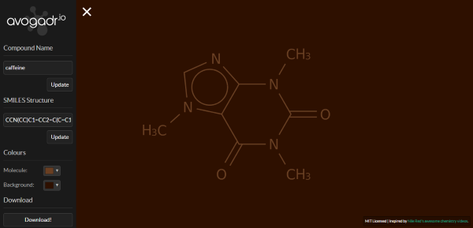

# Silex Base Template
Basic Silex project for a simple website.

I'm presenting here a clean (-ish) starting point for a website written in PHP on Silex. This is a direct port of [my Django base project](https://github.com/lambdacasserole/django-base/).



## Prerequisites
You'll need to have a web server installed and configured with PHP for this to work. I really recommend [XAMPP](https://www.apachefriends.org/), especially for Windows users. Once you've done that you can proceed.

You'll also need [Node.js](https://nodejs.org/en/) and [npm](https://www.npmjs.com/) installed and working.

## Configuration
A couple of files need changing to get the site working for you.

1. Copy `config.yaml.dist` and rename it to `config.yaml`. Fill in the fields according to their descriptions and save.
2. Locate `blog.coffee` and fill in the `blogId` and `apiKey` fields to get your blog working.

## Building
Clone the project down and open the folder in your favourite editor. It's a JetBrains PhpStorm project but you can use whichever paid/free software takes your fancy.

Before anything else, note that this project uses the [Composer](https://getcomposer.org/) package manager. Install composer (see their website) and run:

```
composer install
```

Or alternatively, if you're using the PHAR (make sure the `php.exe` executable is in your PATH):

```
php composer.phar install
```

Then, install the npm packages necessary to build and run the website. Run the following in your terminal in the project root directory:

```
npm install
```

This will install [Bower](https://bower.io/) which will allow you to install the assets the website requires (Bootstrap, jQuery etc.) using the command:

```
bower install
```

Gulp will also have been installed. This will compile the [Less](http://lesscss.org/) and [CoffeeScript](http://coffeescript.org/) into CSS and JavaScript ready for production. Do this using the command:

```
gulp
```

This command will need running again every time you make a change to a Less or CoffeeScript file. If you're working on them, run `gulp watch` in a terminal to watch for file changes and compile accordingly.

## Limitations

I'm not a web designer. The site isn't going to bring a tear to your eye with its beauty.
